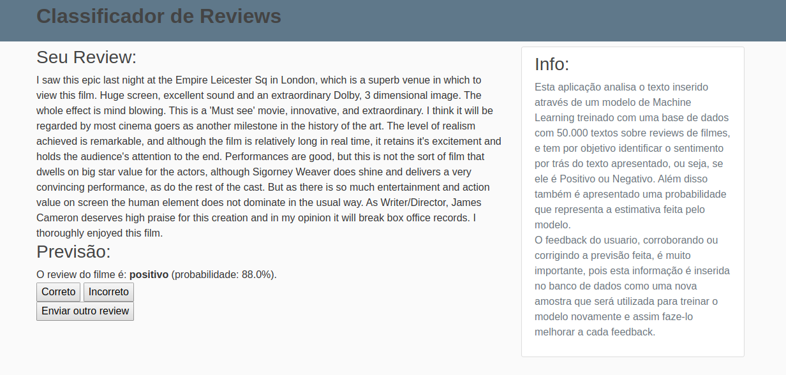

# [Movie Classifier](http://leandro.pythonanywhere.com)

## Info: 

Esta aplicação analisa o texto inserido através de um modelo de Machine Learning treinado com uma base de dados com 50.000 textos sobre reviews de filmes, e tem por objetivo identificar o sentimento por trás do texto apresentado, ou seja, se ele é Positivo ou Negativo. Além disso também é apresentado uma probabilidade que representa a estimativa feita pelo modelo.
O feedback do usuario, corroborando ou corrigindo a previsão feita, é muito importante, pois esta informação é inserida no banco de dados como uma nova amostra que será utilizada para treinar o modelo novamente e assim faze-lo melhorar a cada feedback.

O modelo utilizado foi o de Regressão Logistica, otimizado com SGD, e implementado através da classe SGDClassifier da biblioteca Scikit-Learn. Para o tratamento dos textos, utilizei expressões regulares para remover pontuações e simbolos indesejados, além de uma bag-of-words para remoção das stop words; além disso utilizei uma tecnica chamada Hashing Vectorizer (classe do sk-learn) que além de fazer a tokenização das palavras do texto possui otimizações para identificar as palavras mais importantes para o sentido da frase.
Uma última tecnica utilizada foi a "out-of-core Learning" que nada mais é do que o partial_fit, indicado para uma volume grande dos dados.
OBS: Essas otimizações juntamente com o uso do partial_fit obteve resultados melhores que um modelo anterior otimizado com o GridSearchCV, além de ter sido executado muito mais rapido também!

O framework utlizado para criar a API foi o Flask, juntamente com alguns scripts de HTML e CSS. O app é servido para produção através do serviço (gratuito) do Python Anywhere.
